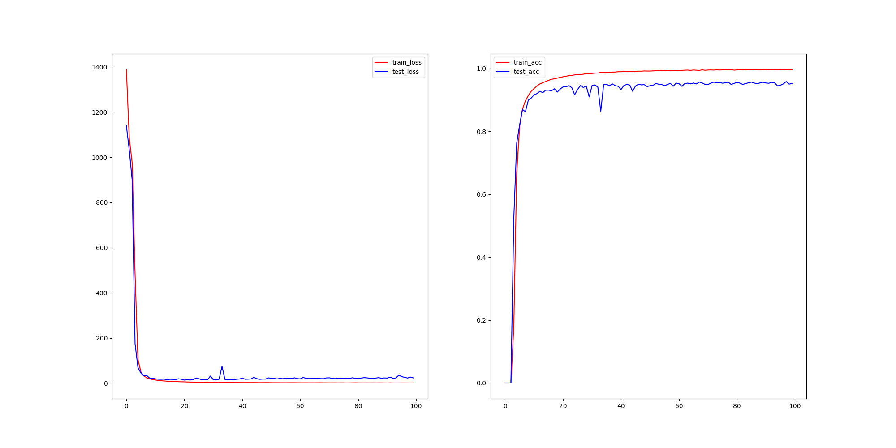

# CaptchaRecognition
End-to-end variable length Captcha recognition using  CNN+RNN+Attention or CTC.  端到端的不定长验证码识别

encoder: CNN+RNN or CNN

decoder: two types of attention +no attention

目前encoder端可以选择使用CNN+RNN或CNN；decoder端有两种attention方式+不使用attention。

## update(2017-10-27)
- RNN+CTC added.  新增了 CNN+RNN + CTC 的验证码识别。

## Usage
Put your font file in fonts directory, and change the font file's name in line 173 of GenCaptcha.py.

To generate training data in data/, run python GenCaptcha.py.

Run python main.py to train.

把字体文件放入fonts文件夹，并修改GenCaptcha.py中第173行的字体文件名。

运行 python GenCaptcha.py ，在data/下生成数据集captcha.npz和captcha.vocab_dict。

（GenCaptcha.py中还提供了生成tfrecord文件的函数。）

运行 python main.py训练。

## Using CTC
Install [warp_ctc for pytorch](https://github.com/SeanNaren/warp-ctc/tree/pytorch_bindings/pytorch_binding), and run  python ctcmain.py.

安装[pytorch下的warp_ctc](https://github.com/SeanNaren/warp-ctc/tree/pytorch_bindings/pytorch_binding),

按照上一节的步骤生成数据后，运行 python ctcmain.py.

## Results
results of using CTC (accuracy reaches 0.95 on test set)：

